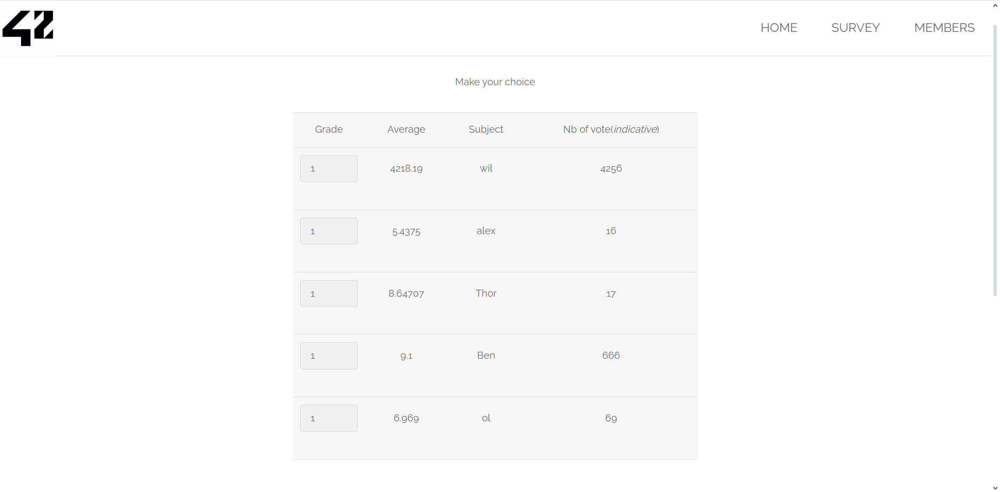

### Flag walkthrough
From the homepage, there's a menu with several links including a 'SURVEY' one ; clicking it redirects us to the [ip]/?page=survey page.
It seems to be a page that allows us to rate 5 people, on a scale from 0 to 10.
The table also displays the total number of votes, and the average grade.
Sending a vote modifies these values, confirming this.

However, it's worth noting that the first name of the list, wil, is the only one with an average grade above 4200, and over 4200 votes. Weird, considering the grades go from 0 to 10.

 

Opening the inspecting tool allows us to manually change the value of the grade, for example setting it to 50, and send it. This immediately gives us the flag.

### Vulnerability explanation
Here again, the user input is not verified and simply accepted as it is. It is easily editable and allows anyone to break the rules and cheat.

### Patch
User input should be verified server side. Make sure it's within the boundaries that we want. Besides, it could be useful to store data and only allow one vote per logged account, to avoid cheating, which is what wil seems to have done.