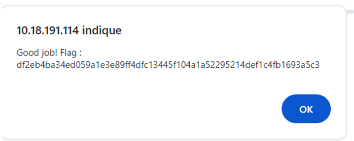

### Flag walkthrough
Looking at the cookies from the inspector tool allows us to find a cookie called "I_am_admin" with a long string that resembles a flag. Putting that string in a dcode tool suggests that it is encrypted with MD5. Decoding it translates it to "false".

Encoding "true", replacing the current cookie with the new string, and refreshing the page, gives us the flag.

### Vulnerability explanation
The cookie is accessible and editable client-side, which is not good especially because this seems to be a sensible cookie. It is called "I am admin", which suggests that the key it contains could be used server-side to verify and grant admin rights, and return sensible data. The fact that it is so easily accessible client-side and editable opens up a risk for it to be stolen and give anyone access to sensible data.
Besides, it is encrypted with a popular cipher.

### Patch
A cookie with a string that seems to give access and rights to certain data (such as a JWT, which this cookie is reminiscent of), should be sent with the option httpOnly. This means that when the token is created server-side upon authentification and sent back to the client, it is unaccessible from the client. It will still be sent with every request in order to verify the rights to access certain data, but the client simply can't see or edit the cookie.
