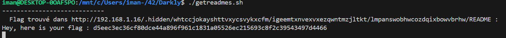

### Flag walkthrough
Exploring the .robots.txt page allows us to find out about 2 hidden pages : /.hidden and /whatever.
The second one will be exploited in the weak password vulnerability.

In this case, we're exploring the .hidden page, which contains a bunch of links and a README file to download.
Each of these links leads to another page full of links, etc. Once in a while, a link will just lead to a page that contains a README.  Most of these READMEs contain a taunting sentence about looking or asking for help.
It seems obvious that the goal here is to explore all of the READMEs, and that one of them will probably contain a flag. Of course, we can't do that manually as there seems to be thousands of them.

With a shell script, we recursively browse all the links of all pages, and scan the content of the READMEs every time we find one of them. If that README contains the word flag, we print it on the standard output.

The script takes about 5 minutes before findind what it's looking for :

### Vulnerability explanation
Several things are wrong here.
First of all, the presence of a "hidden" page mentioned in the .robots.txt, available by everyone and anyone, is not exactly safe. Especially if this hidden page leads to sensitive data.
Second, creating thousands of pages in order to "hide" the sensitive data is simply useless, as it was easily bypassed by a shell script.

### Patch
Sensitive data should not be stored in the root folder of the web application, even if it's "hidden" : there will be a way to access it anyways.