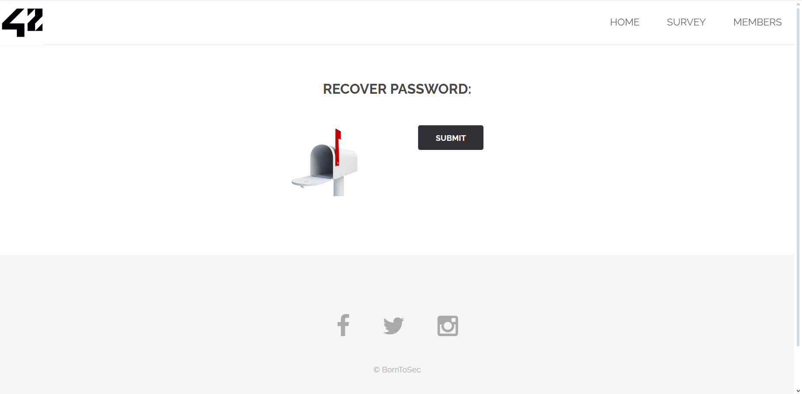

### Flag Walkthrough

On the home page, there's a sign in page with a clickable "forgot my password" link, that leads to the page of interest for this flag : [ip]/?page=recover .
The page has a submit button and nothing else.

A quick inspection of the HTML elements allows us to find a hidden input field of e-mail type with a value already in there, which seems to be the webmaster's e-mail : webmaster@borntosec.com
Replacing this e-mail with any input and clicking submit gives us the flag.

### Vulnerability explanation
Hiding an HTML element with "type=hidden" doesn't make it inaccessible from the browser or even from a command-line interface or any other tool that allows sending requests and receiving responses. The webmaster's e-mail was still visible and editable.

### Patch
If the goal was to send all e-mail reset requests to the webmaster, then the e-mail address should be handled in the server rather than hard-coded in a hidden input field.
