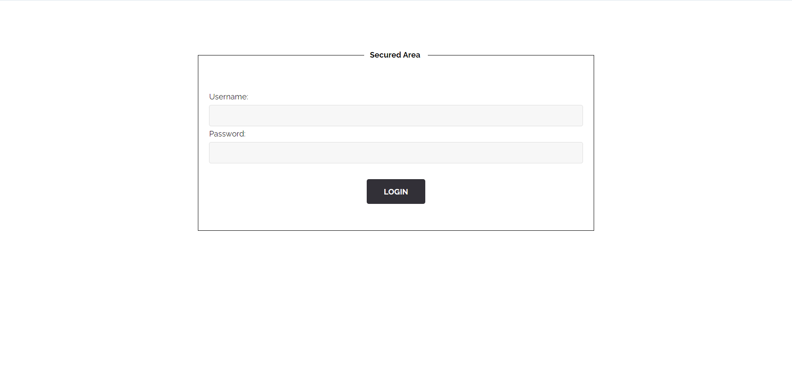

### Flag walkthrough
Exploring the .robots.txt page allows us to find out about 2 hidden pages : /.hidden and /whatever.
The first one is exploited in the files scrapping vulnerability.

In this case, we're exploring the whatever page, which contains a "passwd" file to download.
This file contains a long string, preceeded by "root:".
Using a dcode tool on it allows us to decrypt and translate it to "qwerty123@".
This looks like a password, as the file name suggests it. "root" seems to be the username associated.

Trying this on the sign in page doesn't work, so we need to find another existing page that's not referenced on the homepage.

This is easily achieved with the gobuster CLI software. This takes a url and a list of common page names, and tries them all. We can find such a list on Seclists' Github page, under the folders Web-Content and common.txt.
At first, gobuster can't proceed because our website returns a 200 response even for non-existing pages that actually display a 404 message, or forbidden ones that display a 403 message - both of these seem to be hard coded and not be actual errors, so gobuster doesn't know how to differentiate between an existing and a non-existing page.
To bypass that, we set a length limit to the response. If the page exists, it will contain HTML elements and have a certain length. If the page doesn't exist, it will contain pretty much nothing beside the 404 message.

This allows us to find out about a few unreferenced pages. Most of them are "forbidden", such as the /images/ one.

The one that interests us is the /admin/ page, which contains a login form : exactly what we were looking for.

Logging it with root and qwerty123@ does the trick and leads us to a page containing the flag.

### Vulnerability explanation
Several things are wrong here.
First of all, the presence of a "hidden" page mentioned in the .robots.txt, available by everyone and anyone, is not exactly safe, especially if this hidden page contains admin credentials (or any type of sensitive data).

Second, hiding the admin page by not referencing it is useless because there will be a way to find it anyway.

### Patch
Never store credentials in the root folder of the application even if the page is supposedly hidden (it will be found anyway).
Besides, encrypting it with a popular cipher is not sufficient to protect it : it can be easily decrypted with online tools in under one minute. Hashing it with a key that's only known to the server would be a better option.