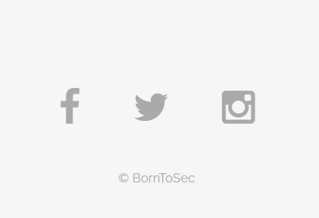

### Flag walkthrough
The footer has a link on the "Born to sec" copyright statement.

It leads us to a page with a weird parameter which is a long, random string. The page shows a random text from Wikipedia about albatros and a picture, with a Youtube link to a song called "I'm an Albatroz".

Inspecting the page allows us to discover commented hints in the html source code.
The hints tells us we need to "come from https://nsa.gov/" and that the browser "ft_bornToSec" will help us.

This is reminiscent of some HTTP headers that can be sent with the request.
The referer header means the page you came from (in this case, it's currently the homepage, since that's where we clicked from to reach this page).
The user-agent header defines the browsers.
Replacing these values before sending a request again for this page, gets us the flag.

### Vulnerability explanation
The HTTP headers aren't verified or restricted, and any request is simply trusted and sent back the response.

### Patch
Put restrictions on the requests' headers. It's not just any request that can come in and get data back.