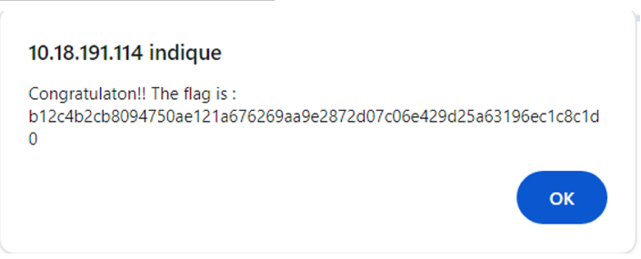

### Flag walkthrough
Typing in the url a non existent page shows an alert that just says "Wtf?".
If we replace the parameters with "/..", the message in the alert slightly differs. As we add more slashes and dots, the messages become more encouraging.

On the OWASP page that lists the most common vulnerabilities, one of them is called path traversal. An example is given with a certain amount of slashes and dots, and then an "etc/passwd" path. Trying the exact same path gives us another alert with the flag, this time.

### Vulnerability explanation
This is a static website and not a dynamic one. The pages are stored in the server and sent depending on the requested page through the parameters of the url.
The parameters seem to be taken as they are, interpreted as a path and sent back. Which is very dangerous, because that allows us to send any path, which means we could therefore access to any data on the server, even files that are outside of the application's root that we aren't supposed to access at all.

### Patch
Once again, the user input needs to be sanitized. It should not be trusted as always valid, nor as an absolute path. Using indexes that translate to actual pages, server-side, could be an alternative.
Whitelisting the valid parameters and their corresponding pages, could be another: the invalid parameters that do not have an associated page, will simply not be treated and return an error.
Surrounding the user input with hard coded code server-side, could ensure that no matter the given path, it will never exceed the boundaries we set, is another solution.