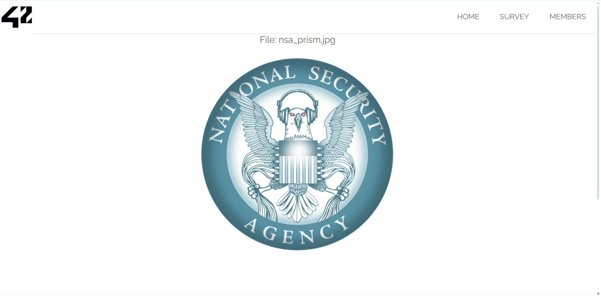

### Flag walkthrough
The homepage contains 3 pictures of logos related to American governemental instances. 

However only one of them is clickable, leading to a page that simply displays it with its filename.

This page's url is [ip]/?page=media&src=nsa.
Curiously, the src parameter in the url and the picture's filename seem to not match ("nsa_prism" vs "nsa").
From there, we can suppose that the media page (also passed as a parameter) lists several pictures that are identified by a variable, and that trying out different variables could maybe display other pictures listed there.

With the inspector tool, we try to find out how the src parameter is used in order to determine the picture to display. We find out that the input is used in an <object> element in the "data=" attribute. This suggest we can try and inject any type of data in there.

The flag is obtained by injecting any code that contains  tags and the keyword "alert" in them. It needs to be encoded in base 64 for the flag to be revealed.

### Vulnerability explanation
Whatever we put as parameter in the URL will be reused and displayed on the page inside an <object> element. This is dangerous, as it allows an attacker to customize and send an URL to a user, that will display malicious content on the page (such as a form that the user might fill and use to unknowingly send sensitive data).
The uninformed victim might trust the link and the page, as it uses a trusted website to display and host that malicious content. Encoding the content in base64 in the URL allows to make it shorter and less suspicious than putting it in clear.

### Patch
Once again, not trusting user input and never display it as it is, is the essential lesson here. It should be sanitized and parsed. Especially here, there is no reason for it to be displayed in an <object> element when it should be used as parameter to browse stored pictures.