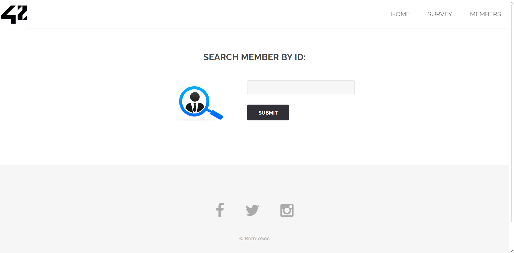
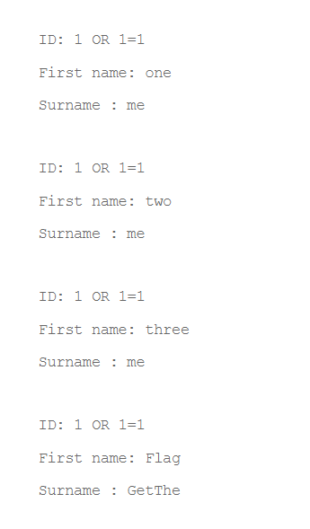
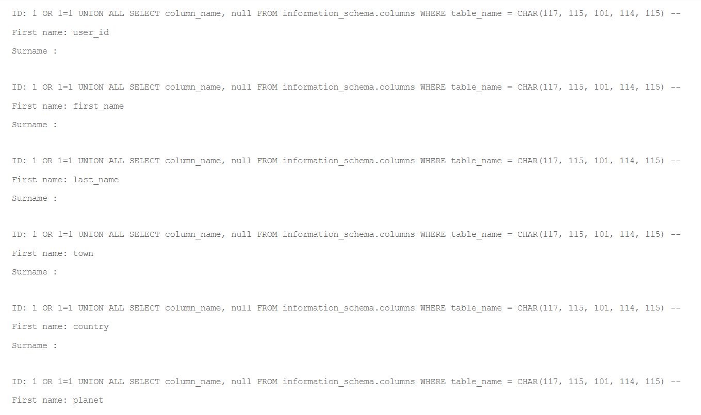
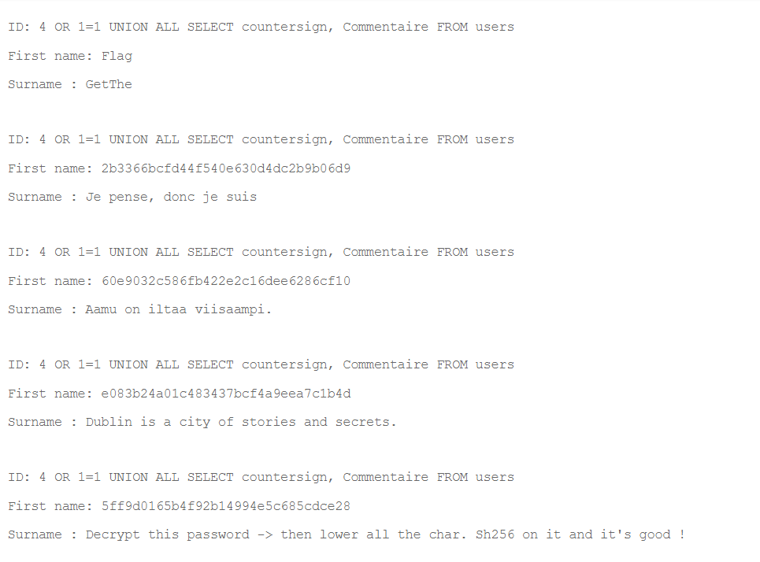

### Flag walkthrough

On the homepage, there's a collection of links in a side menu, which includes a "MEMBERS" link. Clicking it redirects us to the [ip]/?page=member page, which contains a search bar and a submit button, to "search member by id".




If we search numbers, only 1, 2, 3, and 5 return something. All results are in the same format, with what seems to be 3 keys : "ID", "First name" and "Surname", and their values.
For ID number 5, first name is "Flag" and surname is "GetThe".

If we search any string, the page displays an error : « Unknown column [string] in 'where clause' »
This allows us to conclude that there's an error in the way inputs are parsed : instead of being treated as values, they're treated as column names.

If we enter the basic SQL injection input, « 1 OR 1=1 », the page simply returns all 4 users that seem to be in the database.

The format of "ID" allows us to conclude that it is indeed not a column in the database's table, but a hard-coded output.

Thus, we decide to try and list all the columns in the 'users' table, with the following query :
```
ID: 1 OR 1=1 UNION ALL SELECT column_name, null FROM information_schema.columns WHERE table_name = CHAR(117, 115, 101, 114, 115) --
```
(The CHAR format is necessary because writing 'users' results in a syntax error because of the quotes.)

This lists for us the columns, still in the same weird format as before, confirming that neither "ID", "First name" or "Surname" are actual columns but simply hard-coded outputs.


The listed columns are : user_id, first_name, last_name, town, country, planet, Commentaire, countersign.
Obviously the most interesting ones here are **Commentaire** and **countersign**.
We chose to display them with another query injection : 
```
1 OR 1=1 UNION ALL SELECT Commentaire, countersign FROM users
```



From this result it's easy to conclude what to do next. Following the instructions gave us the flag.

### Vulnerability explanation
There are several things wrong in the way this search feature is constructed.
First, the queries aren't constructed well at all: the user input, instead of being taken as the value to search, is taken as the key.
Second, the values and keys that are returned are in fact hard-coded and do not match the actual column names from the database.
Lastly, the worst mistake here is the fact that the application simply allows SQL injections. By sending the right (or the wrong) inputs, we were able to retrieve the information we wanted from the database, even from other tables.

### Patch
The user input should be parsed always! It can't be trusted and sent as it is in the SQL queries. Verifications should be applied, and if the input isn't in the right format, the website should return an error.