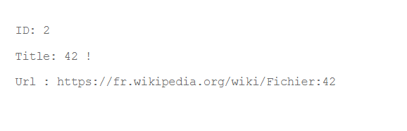
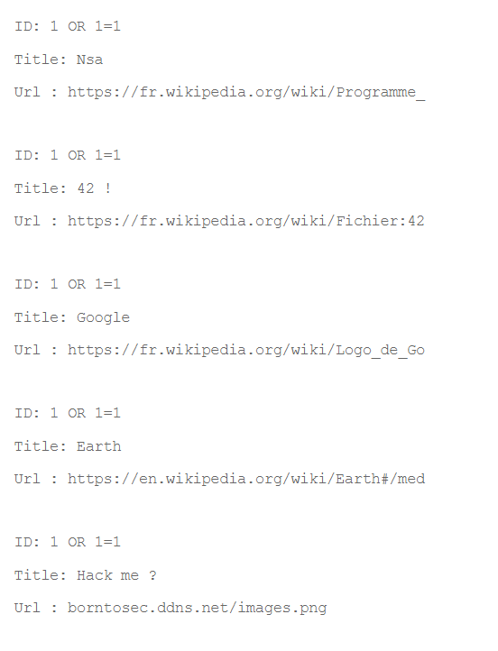
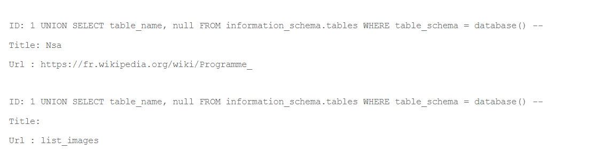

### Flag walkthrough

On the homepage, there's a "SEARCH IMAGE" button. Clicking it redirects us to the [ip]/?page=searchimg page, which contains a search bar and a submit button. A title says "IMAGE NUMBER:"


If we search numbers, only 1, 2, 3, 4 and 5 return something. All results are in the same format, with what seems to be 3 keys : "ID", "Title" and "URL", and their values.
The URLs seem to be links to wikipedia images but some of them are broken. Only the 5th one links to "borntosec.ddns.net/images.png" which is a broken link too.




If we enter the basic SQL injection input, « 1 OR 1=1 », the page simply returns all 5 entries that seem to be in the database.

The format of "ID" allows us to conclude that it is not a column in the database's table, but a hard-coded output.

Thus, we decide to try and send a query that gets us the table name:
```
1 UNION SELECT table_name, null FROM information_schema.tables WHERE table_schema = database() --
```

Still in that weird format, we get this, which seems to suggest the table's name is list_images : 


We then decide to list all the columns in that table : 
```
4 OR 1=1 UNION ALL SELECT column_name, null FROM information_schema.columns WHERE table_name = CHAR(108, 105, 115, 116, 95, 105, 109, 97, 103, 101, 115) --
```
(The CHAR format is necessary because writing 'list_images' results in a syntax error because of the quotes.)

This lists for us the columns, still in the same weird format as before, confirming that neither "ID", "First name" or "Surname" are actual columns but simply hard-coded outputs.


The listed columns are : id, url, title, comment, country.
Obviously the most interesting ones here are **title** and **comment**.
We chose to display them with another query injection : 
```
1 OR 1=1 UNION ALL SELECT title, comment FROM list_images
```


From this result it's easy to conclude what to do next. Following the instructions gave us the flag.

### Vulnerability explanation
Just like with the first SQL injection we found earlier, the values and keys that are returned are in fact hard-coded and do not match the actual column names from the database.
Again, the worst mistake here is the fact that the application simply allows SQL injections. By sending the right (or the wrong) inputs, we were able to retrieve the information we wanted from the database, even from other tables.

### Patch
The user input should be parsed always! It can't be trusted and sent as it is in the SQL queries. Verifications should be applied, and if the input isn't in the right format, the website should return an error.

